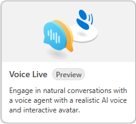

---
lab:
  title: Exploración de Voice Live API
  description: Aprenda a usar y personalizar la Voice Live API disponible en el área de juegos de Fundición de IA de Azure.
---

# Exploración de Voice Live API

En este ejercicio, creará un agente en Fundición de IA de Azure y explorará Voice Live API en el área de juegos de Voz. 

Este ejercicio se realiza en aproximadamente **30** minutos.

> <span style="color:red">**Nota**:</span> Algunas de las tecnologías que se usan en este ejercicio están en versión preliminar o en desarrollo activo. Puede que se produzcan algunos errores, comportamientos o advertencias inesperados.

> <span style="color:red">**Nota**:</span> Este ejercicio está diseñado para realizarse en un entorno de explorador con acceso directo al micrófono del equipo. Aunque los conceptos se pueden explorar en Azure Cloud Shell, las características de voz interactivas requieren acceso al hardware de audio local.

## Creación de un proyecto de Fundición de IA de Azure

Comencemos creando un proyecto de Fundición de IA de Azure.

1. En un explorador web, abre el [Portal de la Fundición de IA de Azure](https://ai.azure.com) en `https://ai.azure.com` e inicia sesión con tus credenciales de Azure. Cierra las sugerencias o paneles de inicio rápido que se abran la primera vez que inicias sesión y, si es necesario, usa el logotipo de **Fundición de IA de Azure** en la parte superior izquierda para navegar a la página principal, que es similar a la siguiente imagen (cierra el panel **Ayuda** si está abierto):

    

1. En la página principal, selecciona **Crear un agente**.

1. En el asistente para **Crear un agente**, escribe un nombre válido para el proyecto. 

1. Selecciona **Opciones avanzadas** y especifica los siguientes valores:
    - **Recurso de Fundición de IA de Azure**: *mantén el nombre predeterminado*
    - **Suscripción**: *suscripción a Azure*
    - **Grupo de recursos**: *crea o selecciona un grupo de recursos*
    - **Región**: Seleccione aleatoriamente una región de las siguientes opciones:\*
        - Este de EE. UU. 2
        - Centro de Suecia

    > \* En el momento de redactar esta información, Voice Live API solo se admite en las regiones enumeradas anteriormente. Seleccionar una ubicación aleatoria ayuda a garantizar que una misma región no esté sobrecargada de tráfico y le ayuda a tener una experiencia más fluida. En caso de que se alcancen los límites de servicio, es posible que tenga que crear otro proyecto en otra región.

1. Selecciona **Crear** y revisa la configuración. Espera hasta que se complete el proceso de configuración.

    >**Nota**: si recibes un error de permisos, selecciona el botón **Corregirlo** para agregar los permisos adecuados para continuar.

1. Cuando se cree el proyecto, se le mostrará de forma predeterminada el área de juegos de Agentes en el Portal de la Fundición de IA de Azure, que debe tener un aspecto similar a la siguiente imagen:

    

## Inicio de una muestra de Voice Live

 En esta sección del ejercicio, interactuará con uno de los agentes. 

1. Seleccione **Áreas de juegos** en el panel de navegación.

1. Busque el grupo **Área de juegos de Voz** y seleccione el botón **Probar el área de juegos de Voz**.

1. El área de juegos de Voz ofrece muchas opciones precompiladas. Use la barra de desplazamiento horizontal para ir al final de la lista y seleccione el icono de **Voice Live**. 

    

1. Seleccione el agente de muestra **Chat informal** en el panel **Probar con muestras**.

1. Asegúrese de que el micrófono y los altavoces funcionan y seleccione el botón **Iniciar** situado en la parte inferior de la página. 

    A medida que interactúa con el agente, observe que puede interrumpirle y se pondrá en pausa para escuchar. Intente hablar con diferentes longitudes de pausas entre palabras y oraciones. Observe la rapidez con la que el agente reconoce las pausas y rellena la conversación. Cuando haya finalizado, seleccione el botón **Finalizar**.

1. Inicie los otros agentes de muestra para explorar cómo se comportan.

    A medida que explora los distintos agentes, observe los cambios en la  sección **Instrucción de respuesta** en el panel **Configuración**.

## Configuración del agente 

En esta sección, cambiará la voz del agente y agregará un avatar al agente de **Chat informal**. El panel **Configuración** se divide en tres secciones: **GenAI**, **Voz** y **Avatar**.

>**Nota:** Si cambia o interactúa con cualquiera de las opciones de configuración, debe seleccionar el botón **Aplicar** situado en la parte inferior del **panel Configuración** para habilitar el agente.

Seleccione el agente de **Chat informal**. A continuación, cambie la voz del agente y agregue un avatar, con las instrucciones siguientes:

1. Seleccione **> Voz** para expandir la sección y acceder a las opciones.

1. Seleccione el menú desplegable de la opción **Voz** y elija otra voz.

1. Seleccione **Aplicar** para guardar los cambios y, a continuación, **Iniciar** para iniciar el agente y escuchar el cambio.

    Repita los pasos anteriores para probar algunas otras voces. Cuando haya terminado con la selección de la voz, continúe con el paso siguiente.

1. Seleccione **> Avatar** para expandir la sección y acceder a las opciones.

1. Seleccione el botón de alternancia para habilitar la característica y seleccione uno de los avatares. 

1. Seleccione **Aplicar** para guardar los cambios y, a continuación, **Iniciar** para iniciar el agente. 

    Observe la animación del avatar y la sincronización con el audio.

1. Expanda la sección **> GenAI** y establezca el botón de alternancia **Involucración proactiva** en la posición desactivada. Seguidamente, seleccione **Aplicar** para guardar los cambios y, a continuación, **Iniciar** para iniciar el agente.

    Con la **involucración proactiva** desactivada, el agente no inicia la conversación. Pregunte al agente: "¿Puedes decirme qué haces?" para iniciar la conversación.

>**Sugerencia:** Puede seleccionar **Restablecer valores predeterminados** y, a continuación, **Aplicar** para devolver el agente a su comportamiento predeterminado.

Cuando haya terminado, continúe con la sección siguiente.

## Creación de un agente de voz

En esta sección creará su propio agente de voz desde cero.

1. Seleccione **Empezar desde cero** en la sección **Probar con el suyo** del panel. 

1. Expanda la sección **> GenAI** del panel **Configuración**.

1. Seleccione el menú desplegable **Modelo de IA generativa** y elija el modelo **GPT-4o Mini Realtime**.

1. Agregue el texto siguiente en la sección **Instrucción de respuesta**.

    ```
    You are a voice agent named "Ava" who acts as a friendly car rental agent. 
    ```

1. Establezca el control deslizante **Temperatura de respuesta** en un valor de **0,8**. 

1. Establezca el botón de alternancia **Involucración proactiva** en la posición activada.

1. Seleccione **Aplicar** para guardar los cambios y, a continuación, **Iniciar** para iniciar el agente.

    El agente se presentará y le preguntará cómo puede ayudarle hoy. Pregunte al agente: "¿Tienes disponible alguna berlina para alquilar el jueves?" Observe cuánto tiempo tarda el agente en responder. Haga al agente otras preguntas para ver cómo responde. Cuando haya terminado, continúe con el paso siguiente.

1. Expanda la sección **> Voz** del panel **Configuración**.

1. Establezca el botón de alternancia **Fin de la expresión (EOU)** en la posición **activada**.

1. Establezca el botón de alternancia **Mejora de audio** en la posición **activada**.

1. Seleccione **Aplicar** para guardar los cambios y, a continuación, **Iniciar** para iniciar el agente.

    Después de que el agente se presenta, pregunte: "¿Tienes algún avión para alquilar?" Observe que el agente responde más rápidamente que antes después de finalizar la pregunta. La opción **Fin de expresión (EOU)** configura el agente para detectar pausas y el final de la voz en función del contexto y la semántica. Esto le permite tener una conversación más natural.

Cuando haya terminado, continúe con la sección siguiente.

## Limpieza de recursos

Ahora que ha finalizado el ejercicio, elimine el proyecto que creó para evitar el uso innecesario de recursos.

1. Seleccione **Centro de administración** en el menú de navegación Fundición de IA.
1. Seleccione **Eliminar proyecto** en el panel de información derecho y confirme la eliminación.

